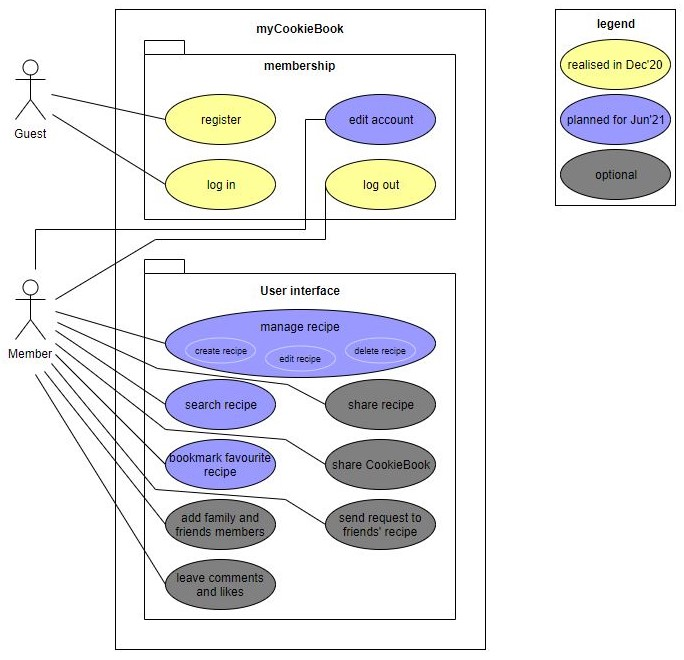

MyCookieBook | Software Requirements Specification
======

- [1. Introduction](#1-introduction)
  * [1.1 Purpose](#11-purpose)
  * [1.2 Scope](#12-scope)
  * [1.3 Definitions, Acronyms and Abbreviations](#13-definitions--acronyms-and-abbreviations)
  * [1.4 References](#14-references)
  * [1.5 Overview](#15-overview)
- [2. Overall Description](#2-overall-description)
  * [2.1 Vision](#21-vision)
  * [2.2 Use Case Diagram](#22-use-case-diagram)
  * [2.3 Technology Stack](#23-technology-stack)
- [3. Specific Requirements](#3-specific-requirements)
  * [3.1 Functionality](#31-functionality)
    + [3.1.1 Functional Requirement One](#311-functional-requirement-one)
- [3.2 Usability](#32-usability)
  * [3.2.1 Usability Requirement One](#321-usability-requirement-one)
- [3.3 Reliability](#33-reliability)
  * [3.3.1 Reliability Requirement One](#331-reliability-requirement-one)
- [3.4 Perfomance](#34-perfomance)
  * [3.4.1 Performance Requirement One](#341-performance-requirement-one)
  * [3.5 Supportability](#35-supportability)
    + [3.5.1 Supportability Requirement One](#351-supportability-requirement-one)
  * [3.6 Design Constraints](#36-design-constraints)
    + [3.6.1 Design Constraint One](#361--design-constraint-one-)
  * [3.7 On-line User Documentation and Help System Requirements](#37-on-line-user-documentation-and-help-system-requirements)
  * [3.8 Purchased Components](#38-purchased-components)
  * [3.9 Interfaces](#39-interfaces)
    + [3.9.1 User Interfaces](#391-user-interfaces)
    + [3.9.2 Hardware Interfaces](#392-hardware-interfaces)
    + [3.9.3 Software Interfaces](#393-software-interfaces)
    + [3.9.4 Communications Interfaces](#394-communications-interfaces)
  * [3.10 Licensing Requirements](#310-licensing-requirements)
  * [3.11 Legal, Copyright, and Other Notices](#311-legal--copyright--and-other-notices)
  * [3.12 Applicable Standards](#312-applicable-standards)
- [4. Supporting Information](#4-supporting-information)

## 1. Introduction

### 1.1 Purpose
This Software Requirements Specification (SRS) gives a general overview over the CookieBook project. It explains our vision and includes detailed information about the features the project contain. It offers insights into the system of frontend and backend, the interfaces in both ends for communication and the constraints of the project.

### 1.2 Scope
The project CookieBook is a web-application. 
The web-application consists of the following features:
- Account
  - register, login, logout, edit profile (change email, password, username)

- Recipe
  - View CookieBook with all recipes of the user
  - create, read, update, delete recipe
  - search for recipe by category, subcategory and by string
  - bookmark recipe as favorite
  - bake recipe (shows every step separately while cooking)

- Static Pages
  - Help
  - Contact us
  - Information privacy
  - Team

### 1.3 Definitions, Acronyms and Abbreviations
| Abbrevation | Explanation                            |
| ----------- | -------------------------------------- |
| SRS         | Software Requirements Specification    |
| UC         | Use Case                             |
| UCD      | overall Use Case Diagram   |
| n/a         | not applicable                         |
| tbd         | to be determined                       |
| FAQ       | Frequently asked questions    |

### 1.4 References
| Title                                                                                                                       | Date       | Publishing organization |
| ----------------------------------------------------------------------------------------------------------------------------|:----------:| ------------------------|
| [MyCookieBook Blog](https://mycookiebook.wordpress.com)                                                                     | 17.10.2020 | Wordpress               |
| [Github](https://github.com/MyCookieBook)                                                                                   | 25.06.2021 | GitHub                  |
| [MyCookieBook Dashboard](https://dhbw-karlsruhe.myjetbrains.com/youtrack/dashboard?id=daa9d0a7-920f-4823-8c67-75f6c7c3bf62) | 17.10.2020 | YouTrack                |

### 1.5 Overview
The following chapters give an overview of this project with our vision based on the overall use case diagram. It also contains information about our detailed software requirements.

## 2. Overall Description
### 2.1 Vision
The idea is to get an overview about tons of different recipes, which are scattered everywhere.

In this case we develop a web application ‘CookieBook’ which allows us to create and save recipes online where they are always accessible. In addition it is possible to search for your  recipes by keywords and mark them favorite.

Have a look at our [blog](https://mycookiebook.wordpress.com/blog/) for more background information.

### 2.2 Use Case Diagram
We created an overall use case diagram to have a better overview. 

* Yellow: Planned until the end of december
* Purple: Planned until the end of june
* Gray: Additional features

### 2.3 Technology Stack

Technologies we use:
* Backend: Java including Jacoco, Gradle, Lombok, SpringBoot, Hibernate JPA, Swagger, Cucumber, JUnit, Mockito
* Frontend: Angular, CSS, HTML, TS
* Database: MySQL
* Hosting: Heroku
* Testing: JUnit, Mockito, Codecov metric for code coverage
* IDE: IntelliJ
* Project Management: YouTrack, Github including CI, Wordpress

### 2.4 Constraints

Our database has a limit of 500 MiB. 

## 3. Specific Requirements
The following section contains all of the functional and quality requirements of the system. It gives a detailed description
of the system and its features. In the following sections our standard requirements for our functions are described.

### 3.1 Functionality - Backend
The backend separates the user interface from the data storage and verifies if the correct permissions
are present to request data. It also ensures that incoming data is parsed and saved correctly. The
data is stored in a database and maintained by the backend.

### 3.1.1 Register 
[The use case specification can be found here](https://github.com/MyCookieBook/MyCookieBook-Documentation/blob/master/UC/register.md)
### 3.1.2 Login 
[The use case specification can be found here](https://github.com/MyCookieBook/MyCookieBook-Documentation/blob/master/UC/login.md)
### 3.1.2 User account
We need an account system to give the users access for managing recipes, edit profile, bookmarking recipes as favorite and searching for recipes. 
### 3.1.3 Edit Profile
[The use case specification can be found here](https://github.com/MyCookieBook/MyCookieBook-Documentation/blob/master/UC/editProfile.md)
### 3.1.4 Manage a recipe
[The use case specification can be found here](https://github.com/MyCookieBook/MyCookieBook-Documentation/blob/master/UC/manageRecipes.md)
### 3.1.5 Search for recipe
[The use case specification can be found here](https://github.com/MyCookieBook/MyCookieBook-Documentation/blob/master/UC/SearchRecipe.md)
### 3.1.6 Bookmark favourite recipe
[The use case specification can be found here](https://github.com/MyCookieBook/MyCookieBook-Documentation/blob/master/UC/bookmarkFavorite.md)

### 3.1.7 Reading data from the database through restservice
Representaional State Transfer services are an architecture for communication between two systems. The REST principle provides an interface and is compatible with most systems. They are particularly suitable for web applications such as ours.

### 3.1.8 Parsing data
- erklären was es macht

### 3.1.9 Providing data
When the user with permission requests data from the frontend, then the backend responses to this request and sends data. This response provides a HTTP statuscode in any case: when the request is successfull or when the request fails.

### 3.2 Functionality - Frontend
The frontend of our application provides a user interface to interact with and is able to request ad receive data from the data backend.

## 3.3 Usability
### 3.3.1 Intuitive user guidance
We develop an intuitive web-application which is as easy as possible to use and gives the user the opportunity to save recipes in his own Cookiebook in order to have recipes at one place instead of having a lot of notes somewhere at home.
### 3.3.2 FAQ
We implement a FAQ to help the user on using the web-application. 
### 3.3.3. Smartphonefriendly (optional)
The web-application is  smartphonefriendly.

## 3.4 Reliability
### 3.4.1 Server availability
The website servers should always be online so the user has always access to his CookieBook
 
### 3.4.2 Data privacy
The data of the user is visible only for him.

## 3.5 Perfomance
### 3.5.1 Response time
The response time is as low as possible. 
### 3.5.2 Server availability
The server should always be online to provide access to data.
### 3.5.3 Memory
n/a
### 3.6 Supportability
n/a
### 3.7 Design Constraints
Our focus is to build a modern application with modern technologies. 
### 3.7.1 Spring Boot 
Spring Boot is a framework for web applications. The development with Java is simplified and functionalities are made available.

### 3.8 On-line User Documentation and Help System Requirements
We focus on building an intuitive modern-looking web-application to allow users to use our website without problems. We also implement an "FAQ" that contains instructions on how to use the application, features and leave our contacts for possible questions. 
### 3.9 Purchased Components
n/a
### 3.10 Interfaces
#### 3.10.1 User Interfaces
Implemented user interfaces:
 - Log In page
 - Profile page
 - Recipe overview page
 - Recipe datail page
 - Bake recipe page
 - Information pages 
#### 3.10.2 Hardware Interfaces
n/a
#### 3.10.3 Software Interfaces
CookieBook is a web-application, so it should run in any browser. We test our web-application on Safari, Chrome, FireFox, Microsoft Edge.
For communication between the frontend (user view) and the backend, rest services are sent. This sends the frontend to the pool end after an action of the user. This responds with either a status message or an object that can be read from the frontend and passed on to the user.

- ausführen, wie das BE funktioniert mit RESTservice etc
- wie ist die verbindung aufgebaut zwischen BE und datenbank?
- 
#### 3.10.4 Communications Interfaces
Every HTTP request and response contains a JSON. Our project system is able to transfer all the needed data between backend and frontend by interpreting the content of this JSON.

### 3.11 Licensing Requirements
n/a

### 3.12 Legal, Copyright, and Other Notices
CookieBook retains the rights on their logo.
All other used pictures are linked to the website under '.../More'.

### 3.13 Applicable Standards
n/a

## 4. Supporting Information
Please visit our [blog](https://mycookiebook.wordpress.com/) for more information.
