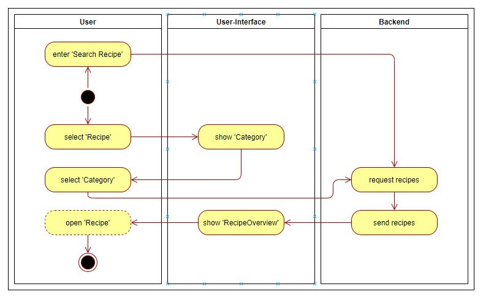
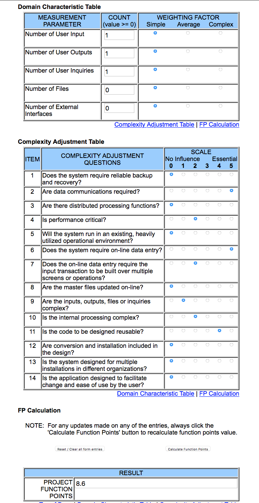

# Cookiebook
## Use Case Specification: Search for Recipe
### Table of Contents
- [1. Specification - Search for recipe](#1-specification-SearchRecipe)
    - [1.1 Brief Description](#11-brief-description)
- [2. Flow of Events](#2-flow-of-events)
    - [2.1 Basic Flow](#21-basic-flow)
        - [2.1.1 Activity Diagram](#211-activity-diagram)
        - [2.1.2 Mockup](#212-mockup)
        - [2.1.3 Narrative](#213-narrative)
- [3. Special Requirements](#3-special-requirements)
- [4. Precondition](#4-preconditions)  
- [5. Postconditions](#5-postconditions)
- [6. Extension Points](#6-extension-points)
- [7. Function Points](#7-function-points)

## 1. Use Case Specification - Search for recipe
##### 1.1 Brief Description
This use case describes the search for recipe process for the CookieBook application.

## 2. Flow of Events
### 2.1 Basic Flow
#### 2.1.1 Activity Diagram

#### 2.1.2 Mockup

## 3. Special Requirements
n/a
## 4. Preconditions
The main preconditions for this use case are:
- The user has internet connection.
- The user opens the web-application.
- The user is logged in.
- The user moves to the search field and types keyword.
## 5. Postcondition
The main postconditions for this use case are:
The user gets a recipes list, where the keyword is in the title, other, material, ingredients and steps.
## 6. Function Points
                                                                                                                                               
